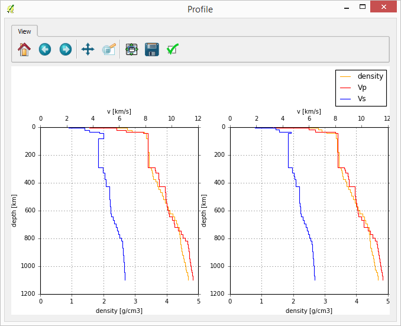

# EqHazard
A QGIS Python plugin for the visualization of earthquake hazard data profiles.

Data sources are listed (as file paths) in the attribute table of a point layer.

Two types of data info can be visualised, by choosing the relevant source field: 
- layer info: density, velocities and Q values can be plotted against depth
- strong motion data: time vs. velocity plots

Input file format
For layer info, data in the source files are organised as in the example:

vp and vs rho depth thk till 1100 km only changed
thk(km) rho   Vp(km/s)  Vs(km/s)    Qp       Qs     depth(km) layer
   2.0000 2.45  4.300000  2.530000   225.00   100.00    0.00000   1
   4.0000 2.50  4.600000  3.400000   225.00   100.00    2.00000   2
   6.0000 2.76  5.900000  3.500000   225.01   100.00    6.00000   3
  12.0000 2.87  6.450000  3.800000   225.00   100.00   12.00000   4
   6.0000 2.90  6.500000  3.900000   225.00   100.00   24.00000   5 
  10.0000 3.15  7.300000  4.300000  1000.00   450.00   30.50000   6
  10.0000 3.27  7.800000  4.600000  1000.00   450.00   40.00000   7
  30.0000 3.35  8.100000  4.700000  1000.00   450.00   50.00000   8 

For strong motion data, source files are as in the following example:

 #	time	velocity
	  0.000000E+00	  0.608998E-03
	  0.341797E+00	 -0.653854E-03
	  0.683594E+00	 -0.147770E-02
	  0.102539E+01	  0.623775E-03
	  0.136719E+01	 -0.882788E-03
	  0.170898E+01	 -0.138714E-02
	  0.205078E+01	  0.584612E-03
	  0.239258E+01	 -0.145040E-02
	  0.273438E+01	 -0.158983E-02

